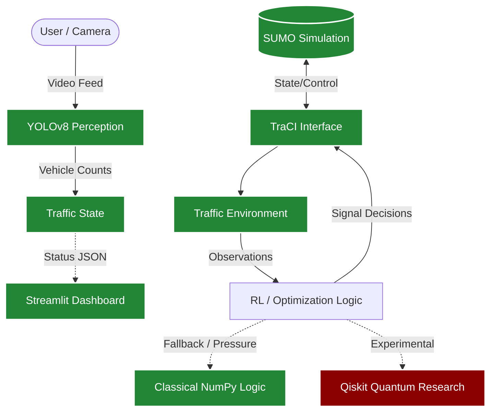

# Traffic Detection & Intelligent Signal Optimization

An experimental intelligent traffic-control system bridging computer vision, microscopic traffic simulation, and reinforcement learning to optimize signal timing and reduce congestion.

## 1. Overview
Traffic congestion causes significant economic loss, environmental damage, and lost time. Traditional static traffic signals fail to adapt to real-time road conditions. This project presents an experimental approach to intelligent traffic control. By combining computer vision (YOLOv8) to detect vehicles in real-time with microscopic traffic simulation (SUMO) and reinforcement learning (PPO), the system dynamically calculates traffic pressure and optimizes signal phases to improve throughput.

## 2. Key Features

### Pro Version
- **SUMO Simulation**: Microscopic traffic simulation modeling realistic vehicle behavior.
- **TraCI Control**: Dynamic, programmatic control of traffic signals and simulation state.
- **YOLOv8 Vehicle Detection**: Real-time perception and vehicle counting.
- **Streamlit Dashboard**: Live analytics and visual monitoring interface.
- **Traffic-State Monitoring**: Real-time extraction of density and queue lengths.
- **RL/PPO Components**: Reinforcement learning definitions for signal optimization.
- **Quantum Research**: Experimental hybrid quantum-classical optimization logic.
- **Jagatpura Network**: Custom simulated local road network mapping.

### Basic Version
- **Stable-Baselines3 PPO**: Core reinforcement learning training loop.
- **Custom Traffic Environment**: Gymnasium-based environment for RL agent training.
- **Traffic-Signal Action Space**: Discrete actions mapping to signal phase modifications.
- **Simulation-Based Evaluation**: 100-step smoke test for rapid policy evaluation.

## 3. Architecture


*(Green indicates verified runtime components; Red indicates experimental/research components)*

## 4. Project Structure
```text
Traffic-Detection/
├── 01_Pro_Version/
│   ├── control/         # RL agents and quantum logic definitions
│   ├── data/            # Runtime analytics charts and sample reports
│   ├── docs/            # Model checkpoints and documentation
│   ├── environment/     # SUMO maps, route files, and main.py simulation runner
│   ├── perception/      # YOLOv8 integration and canonical model
│   └── ui/              # Streamlit dashboard app (app.py)
├── 02_Basic_Version/
│   ├── agents/          # RL agent configurations
│   ├── env/             # Custom Gymnasium traffic environment
│   ├── models/          # Sensor/vision mocks
│   ├── quantum/         # Experimental quantum optimizers
│   ├── simulation/      # Basic simulation wrappers
│   ├── utils/           # Configuration files
│   ├── visualization/   # Data visualization scripts
│   ├── ppo_traffic.zip  # Trained PPO model
│   ├── requirements.txt # Python dependencies for the Basic Version
│   └── main.py          # Basic Version runner
├── .gitignore
└── README.md
```

## 5. Technologies
- **Python** 
- **SUMO (Simulation of Urban MObility)**
- **TraCI (Traffic Control Interface)**
- **Streamlit**
- **OpenCV**
- **Ultralytics YOLO**
- **PyTorch**
- **Stable-Baselines3**
- **Gymnasium**
- **NumPy & Pandas**
- **Qiskit** (for experimental quantum components)

## 6. Requirements

### Required for Pro Version
- **Python 3.8+**
- **SUMO 1.26.0** (Must be installed and added to PATH, or configured via `SUMO_HOME` environment variable).
- **Python Packages**: `streamlit`, `pandas`, `ultralytics`, `traci`, `opencv-python`.
- **YOLO Model**: Provided in `01_Pro_Version/perception/yolov8n.pt`.

### Required for Basic Version
- **Python Dependencies**: Defined in `02_Basic_Version/requirements.txt` (includes `stable-baselines3`, `gymnasium`, `torch`, `qiskit`, etc.).
- **PPO Model**: Provided as `ppo_traffic.zip` in the directory.

### Optional (CARLA)
- The CARLA Simulator is an **optional** 3D visualization and simulation dependency used by experimental standalone scripts.
- **Note**: CARLA is *not* required for the main SUMO + Streamlit workflow.

## 7. Installation

1. **Clone repository**:
   ```bash
   git clone https://github.com/mananbd07/Traffic-Detection.git
   cd Traffic-Detection
   ```

2. **Install SUMO**:
   Download and install [Eclipse SUMO 1.26.0](https://sumo.dlr.de/docs/Downloads.php) for Windows.
   Ensure SUMO is available through your system PATH, or set the `SUMO_HOME` environment variable to your installation directory (e.g., `C:\Program Files (x86)\Eclipse\Sumo`).
   Verify installation:
   ```bash
   sumo --version
   ```

3. **Install Python dependencies**:
   For the Basic Version:
   ```bash
   cd 02_Basic_Version
   pip install -r requirements.txt
   ```
   For the Pro Version, install the primary packages:
   ```bash
   pip install streamlit pandas ultralytics traci opencv-python
   ```

## 8. Running the Pro Version

The Pro Version requires starting both the SUMO simulation and the Streamlit dashboard. **Two separate terminal windows are required.**

**Terminal 1: Start SUMO/Traffic Environment**
```bash
cd 01_Pro_Version/environment
python main.py
```
*Expect to see the SUMO GUI launch, load the Jagatpura network, and begin processing traffic steps. Terminal output will show traffic status and optimization updates.*

**Terminal 2: Start Streamlit Dashboard**
```bash
cd 01_Pro_Version/ui
python -m streamlit run app.py
```
*Expect your default web browser to open to `http://localhost:8501`, displaying live traffic analytics, vehicle counts, and the CCTV camera feed.*

## 9. Running the Basic Version

To run the streamlined reinforcement learning evaluation:
```bash
cd 02_Basic_Version
python main.py
```
*This command loads the trained Stable-Baselines3 PPO policy (`ppo_traffic.zip`) and runs a 100-step smoke test in the custom environment, printing rewards and traffic states to the terminal.*

## 10. YOLO Vehicle Detection
The system utilizes **YOLOv8 Nano** for efficient, real-time vehicle detection.
- **Canonical Model Location**: `01_Pro_Version/perception/yolov8n.pt`.
- **Function**: Integrates directly into the Streamlit UI to process the camera feed (currently utilizing the local webcam via `cv2.VideoCapture(0)`).
- **Target Classes**: Detects and counts cars, trucks, buses, and motorcycles to calculate lane density.

## 11. Reinforcement Learning
Traffic signal optimization is framed as a Reinforcement Learning problem solved via **Proximal Policy Optimization (PPO)**.
- **Observation Representation**: The state space consists of queue lengths, vehicle densities, and current signal phases.
- **Action Representation**: Discrete actions corresponding to phase changes (e.g., extend green, switch to yellow/red).
- **Reward Concept**: The agent is rewarded for minimizing cumulative waiting time and maximizing overall intersection throughput.

## 12. Quantum / Experimental Research
While standard RL provides the baseline, this repository explores hybrid quantum-classical algorithms for complex traffic networks.
- **Qiskit-based components** exist in the repository for quantum circuit definitions and model training.
- **Important Distinction**: The currently verified primary runtime does **not** rely on live quantum hardware execution.
- During live simulation (`main.py`), the runtime currently uses classical heuristic/NumPy logic to calculate traffic pressure and emulate optimization behavior.

## 13. CARLA
CARLA is an optional external simulator.
- The massive `CARLA_Server` binary distribution is deliberately **not** tracked in this repository.
- Users interested in the experimental CARLA integration scripts (e.g., `quantum_controller.py`) must install CARLA separately.
- The main SUMO + Streamlit workflow does not require CARLA.

## 14. Data and Runtime Files
When running the simulation, several files are generated dynamically:
- `live_status.json`, `state.json`
- `results.csv`, `results.xml`
- `traffic_log.csv`

These are runtime artifacts used for inter-process communication (e.g., passing data from SUMO to Streamlit) and logging. They are intentionally **ignored** by Git and are not tracked in the repository.

## 15. Current Verification Status

| Component | Status |
| :--- | :--- |
| **Basic RL** | Verified |
| **SUMO** | Verified |
| **TraCI** | Verified |
| **YOLO** | Verified |
| **Streamlit** | Verified |
| **Pro Version startup** | Verified |
| **Live state generation** | Verified |
| **CARLA** | Optional / not part of primary runtime |
| **Cloud deployment** | Not currently deployed |

## 16. Limitations / Known Future Improvements
- The current Streamlit CCTV workflow depends on a local webcam (`cv2.VideoCapture(0)`).
- Runtime state synchronization currently uses JSON file communication, which may introduce latency at scale.
- CARLA integration remains a separate experimental track.
- The quantum runtime logic is not currently executing on live quantum hardware.
- Cloud deployment and containerization (Docker) have not been implemented.
- Larger-scale city-wide deployment would require a robust architectural shift from file-based communication to an API/service layer.

## 17. Roadmap
- [x] Repair legacy paths
- [x] Verify SUMO/TraCI
- [x] Verify YOLO
- [x] Verify Basic PPO
- [x] Repair Streamlit startup
- [x] Repository sanitization
- [ ] Improve video input beyond local webcam
- [ ] Replace file-based state communication with API/service layer
- [ ] Improve deployment portability
- [ ] Further evaluate quantum-classical optimization
- [ ] Cloud/deployment architecture

## 18. Author / Project
**Manan Bidawatka**

GitHub: [https://github.com/mananbd07](https://github.com/mananbd07)  
Repository: [https://github.com/mananbd07/Traffic-Detection](https://github.com/mananbd07/Traffic-Detection)
